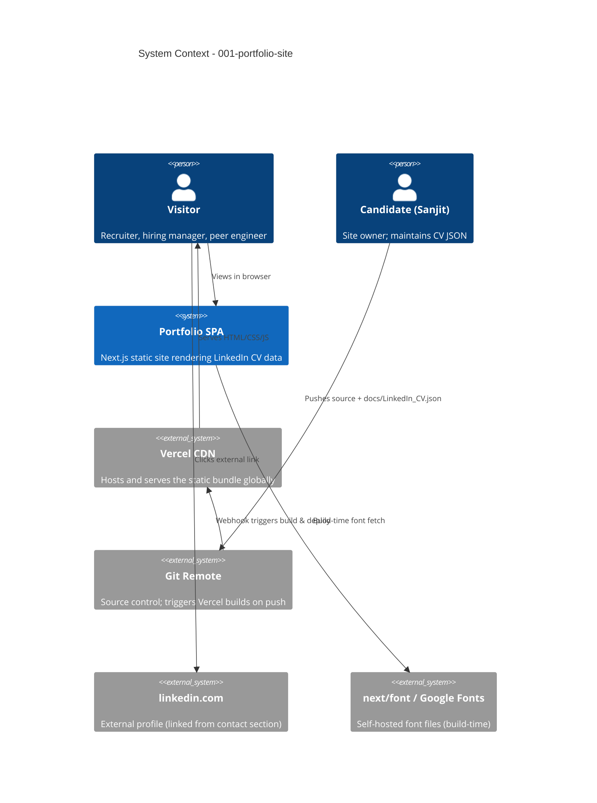

# 001-portfolio-site - System Context

## System Overview

A static, single-page portfolio website built with Next.js (App Router) and Tailwind CSS. It reads structured content from `docs/LinkedIn_CV.json` at build time, validates the data with a Zod schema, and renders it as accessible React Server Components. The output is a static HTML/CSS/JS bundle deployed to Vercel's global CDN.

The system has **no runtime backend**, **no database**, and **no user accounts**. It is a read-only public site: the only "actor" is a browser viewing a pre-rendered page.

## Actors

| Actor | Type | Description |
|-------|------|-------------|
| **Visitor** | Human | A recruiter, hiring manager, peer engineer, or anyone who lands on the portfolio. Reads content, navigates sections, may toggle theme. No write actions, no auth. |
| **Candidate (Sanjit)** | Human (owner) | Maintains `docs/LinkedIn_CV.json` and deploys. Not a runtime user. |
| **Vercel Build Pipeline** | System | Reads the Git repository, runs `bun install && bun run build`, and publishes the static output. Triggered on every push to `main` (production) and every PR (preview). |
| **Browser** | System | The runtime. Loads the static bundle, renders React, executes theme toggle / nav interactions client-side. |

## External Integrations

| System | Purpose | Direction | Data Exchanged | Protocol |
|--------|---------|-----------|----------------|----------|
| **Vercel CDN** | Hosting & global delivery | Outbound (from build) → Inbound (to visitor) | Static HTML/CSS/JS, fonts, favicon | HTTPS |
| **Git remote (GitHub assumed)** | Source control; triggers Vercel builds | Outbound (git push) | Source code, `docs/LinkedIn_CV.json` | HTTPS / Git |
| **LinkedIn profile** | Referenced for verification | None — out-of-band link only | URL only (`https://www.linkedin.com/in/sanjitmajumdar`) | HTTPS, target=`_blank` |
| **`next/font` (Google Fonts mirror)** | Self-hosted Inter & JetBrains Mono at build time | Build-time only | Font files (`.woff2`) | HTTPS, downloaded at `next build` |

No third-party APIs are called at runtime. No analytics, no telemetry, no external scripts beyond Vercel's automatic instrumentation (which is optional and disabled by default).

## Data Flows

### Inbound (build time)
- `docs/LinkedIn_CV.json` — sole content source. Validated against a Zod schema; build fails on schema mismatch.
- Font files (Inter, JetBrains Mono) — downloaded once at build time by `next/font`, then self-hosted. No runtime fetch.

### Inbound (runtime)
- Browser requests `https://{domain}/` → Vercel CDN serves the pre-rendered HTML/CSS/JS bundle.
- `localStorage` (`theme-preference`) — read on page load to apply user's stored theme.
- `matchMedia('(prefers-color-scheme: dark)')` — read on first visit to set initial theme.

### Outbound
- `mailto:` link opens the user's email client with `sanjit.majumdar.201312@gmail.com` pre-filled.
- `tel:` link initiates a phone call to the number on the device.
- External links to LinkedIn and personal website open in a new tab with `rel="noopener noreferrer"`.

### Build-time data flow

```text
docs/LinkedIn_CV.json
        │
        ▼
[lib/cv-data.ts]  ── Zod validate ──▶  typed CV object
        │
        ▼
React Server Components in app/page.tsx  ── render to HTML
        │
        ▼
.next/  static export
        │
        ▼
Vercel CDN  ── serves to visitors worldwide
```

## System Context Diagram



## High-Level Constraints

- **Static only**: No runtime server, no API routes, no serverless functions. The site must build into pure static assets.
- **Single data source**: `docs/LinkedIn_CV.json` is the only content input. Adding a new section means adding a new field to that JSON.
- **Privacy default**: Physical home address is in the JSON but **never rendered** — enforced at the rendering layer.
- **Build-time validation**: Schema mismatch = build failure. A portfolio that silently renders empty is worse than one that fails to build.
- **No third-party runtime scripts**: No analytics, no tag managers, no chat widgets. Vercel's automatic instrumentation is the only external client-side code (and can be disabled).
- **Browser support**: Modern evergreen browsers (Chrome/Firefox/Safari/Edge, latest 2 releases). No IE11, no legacy polyfills.

## Key NFR Goals

- **Performance**: Lighthouse Performance ≥ 90; FCP < 1.5s; LCP < 2.5s; CLS < 0.1; JS bundle < 200KB gzipped.
- **Accessibility**: WCAG 2.1 AA — semantic HTML, keyboard navigation, color contrast, focus indicators, `prefers-reduced-motion`.
- **SEO**: Proper `<title>`, `<meta description>`, Open Graph tags for LinkedIn/Twitter sharing; `sitemap.xml` and `robots.txt` generated.
- **Maintainability**: TypeScript strict mode, 0 lint errors, Vitest for critical `lib/` paths only.
- **Reliability**: 100% successful builds on `main`; Vercel SLA provides 99.9% availability.

## Future-Proofing Notes

These are **not in scope** for v1 but are worth keeping in mind during design:

- If a blog or CMS is added later, the same `lib/data-loader` pattern can be extended for content collections.
- If a contact form is added, it would require a serverless function or third-party form service (e.g., Formspree) — Vercel Functions can host it without changing the architecture significantly.
- If analytics are added later, Vercel Web Analytics (first-party, cookie-less) integrates with zero code changes.