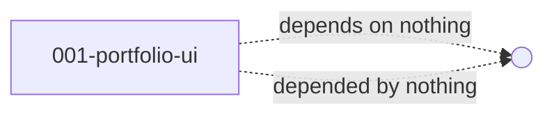

# 001-portfolio-site - Unit Decomposition

## Units Overview

This intent decomposes into **1 unit** of work. The project is a single-page Next.js application; per the project type configuration (`frontend-app`), the catalog specifies a single frontend unit with `feature-based` decomposition and `simple-construction-bolt` as the default bolt type.

The unit internally groups its stories by feature (hero, about, experience, etc.) — but these are **features, not separate units**, because they all render in the same Next.js app, share the same data loader, and deploy as one bundle.

### Unit 1: 001-portfolio-ui

**Description**: The complete frontend application — a Next.js (App Router) single-page portfolio that renders the candidate's CV data as a styled, accessible, responsive web page. Includes navigation, theme toggle, SEO metadata, build-time data validation, and Vercel deployment configuration.

**Stories** (16 total — see Unit Brief for full list):

- 001-bootstrap: Scaffold Next.js + Tailwind + bun + Vercel config
- 002-cv-data: CV type definitions + Zod schema + data loader
- 003-shared-components: Reusable Section, Container, Heading, Tag, Card primitives
- 004-hero: Hero section (name, title, headline, CTAs)
- 005-about: About / Summary section
- 006-experience: Experience list (company, title, dates, responsibilities)
- 007-skills: Skills tags
- 008-education: Education list
- 009-certifications: Certifications list
- 010-languages: Languages list (Could priority)
- 011-honors: Honors & Awards (Could priority)
- 012-contact: Contact section (privacy-aware; no address)
- 013-nav: Sticky top nav with scroll-spy and mobile hamburger
- 014-theme: Light/dark theme toggle with localStorage persistence
- 015-seo: Meta tags, Open Graph, sitemap, robots, favicon
- 016-deploy: Vercel deployment verification + last-updated timestamp

**Deliverables**:

- `app/` (Next.js App Router routes)
- `components/` (feature-grouped React components)
- `components/shared/` (reusable primitives)
- `lib/cv-types.ts` (TypeScript types from Zod schema)
- `lib/cv-data.ts` (validated data loader with build-time failure)
- `docs/LinkedIn_CV.json` (data source — preserved, not modified)
- `next.config.ts`, `tailwind.config.ts`, `tsconfig.json`, `package.json`
- `.prettierrc`, `.eslintrc.json`
- `app/robots.ts`, `app/sitemap.ts`
- Vercel auto-detected (no `vercel.json` needed unless customizing)

**Dependencies**:

- Depends on: None (this is the only unit)
- Depended by: None (standalone SPA)

**External Dependencies**:

| System | Purpose | Risk |
|--------|---------|------|
| Vercel | Hosting & CDN | Low (free tier, industry standard) |
| `next/font` | Self-hosted Inter + JetBrains Mono | Low (build-time, cached) |
| `lucide-react` | Icons (Heroicons) | Low (small, tree-shakable) |
| `zod` | Runtime schema validation | Low (battle-tested) |

**Estimated Complexity**: **M** (Medium) — Not trivial (15+ features, data validation, theming, a11y) but not large (no backend, no auth, single page).

## Unit Dependency Graph

```text
[001-portfolio-ui]  ── (self-contained, no inter-unit dependencies)
```



## Execution Order

Construction will execute as a single unit. Within the unit, stories are grouped into **3 construction bolts** by logical layer (foundation → sections → polish):

| Bolt | Bolt Type | Stories | Objective |
|------|-----------|---------|-----------|
| `001-portfolio-ui-foundation` | Simple | 001, 002, 003 | Bootstrap project, data layer, shared primitives |
| `001-portfolio-ui-sections` | Simple | 004, 005, 006, 007, 008, 009, 010, 011, 012 | Render every content section from CV JSON |
| `001-portfolio-ui-polish` | Simple | 013, 014, 015, 016 | Nav, theme toggle, SEO, deploy verification |

### Why 3 bolts (not 1 monolith, not 16 micro-bolts)

- **Foundation first** — project must build before any sections can render
- **Sections together** — they're all thin wrappers around the same data; building them in one bolt keeps the AI agent's context focused
- **Polish last** — nav, theme, and SEO are cross-cutting concerns that benefit from a working site to validate against

This sequencing keeps each bolt at "hours, not days" while preserving the ability to verify at the end of each bolt.

## Decisions

| Decision | Rationale |
|----------|-----------|
| Single frontend unit (not split by feature into multiple units) | Catalog says `feature-based` decomposition for `frontend-app`, but the project is a single Next.js app where every feature shares the same routing, data, and deployment. Splitting into multiple units would create false boundaries. Features are expressed as **stories within the unit**, which is the right granularity. |
| 3 bolts within the unit, not 1 or 16 | Balances bolt size ("hours, not days") with context focus. AI agents get a clear, scoped set of stories per bolt. |
| `simple-construction-bolt` for every bolt | No complex business logic, no domain modeling needed. The catalog's default for `frontend-app` is `simple-construction-bolt`. |
| Foundation → Sections → Polish ordering | Each phase produces something visible. Foundation proves the toolchain works. Sections prove the data flows. Polish proves it's production-ready. |
